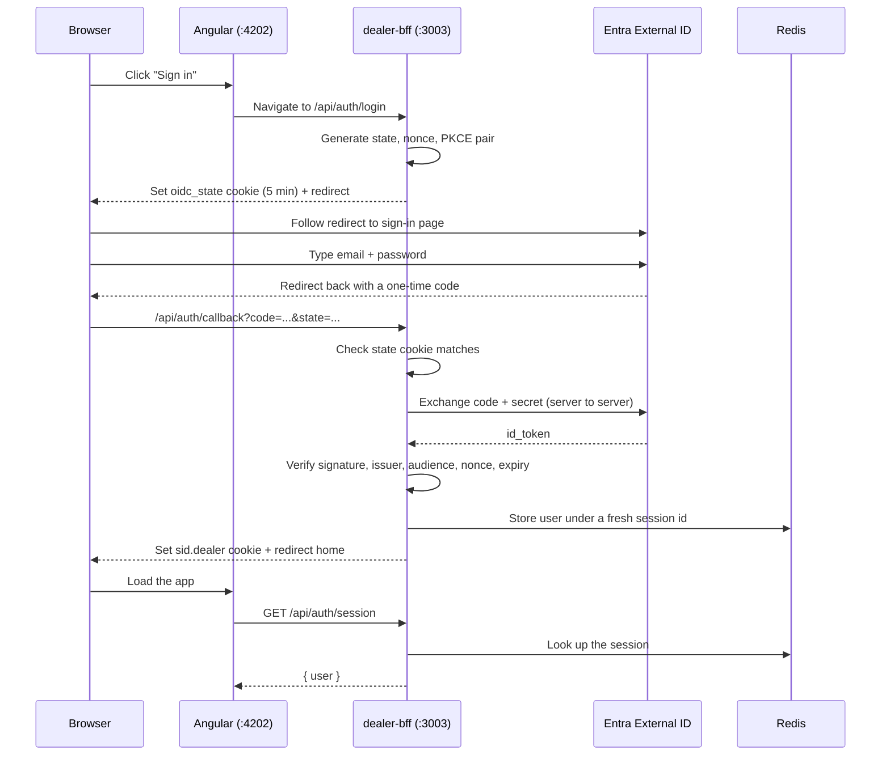

# How logging in actually works

A plain-English walkthrough of what happens between clicking "Sign in" and seeing data on
screen. Written so someone who has never touched OIDC can follow it.

Companion docs: [feature-overview.md](feature-overview.md) (what the apps are),
[session-strategy.md](session-strategy.md) (why sessions are shaped this way),
[bff-security-review.md](bff-security-review.md) (the security audit).

---

## 1. The cast

| Who              | What it is                               | Where it runs       |
| ---------------- | ---------------------------------------- | ------------------- |
| **The frontend** | An Angular app (dealer, broker, agent…)  | In your browser     |
| **The BFF**      | A small Fastify server, one per frontend | On our servers      |
| **Entra**        | Microsoft's identity service             | Microsoft's servers |
| **Redis**        | Fast key/value storage for sessions      | Our infrastructure  |
| **The ESL**      | The enterprise system holding real data  | Our infrastructure  |

"BFF" means **Backend For Frontend**. Each frontend gets its own private backend. The dealer
app talks only to dealer-bff, the broker app only to broker-bff, and so on. They don't share
a backend, which is what makes it possible to keep the two audiences apart.

The golden rule: **the browser never talks to Entra's API, Redis, or the ESL directly.** It
only ever talks to its own BFF. Everything sensitive lives behind that line.

---

## 2. Three different ways in

The POC has three tiers of user, and they log in differently:

1. **Staff (agent app)** — Microsoft work account, via the company's Entra **workforce**
   tenant. This is normal corporate SSO.
2. **Dealers and brokers** — email + password, stored and managed in Entra **External ID**
   (Microsoft's product for customer accounts, sometimes called CIAM).
3. **The public (client app)** — no account at all. A one-time code sent by email.

Tiers 1 and 2 use **exactly the same code path**. That's the whole point of the design: a
work-account login and an email/password login are both OIDC, and differ only in which
Entra address we point at. Section 3 describes that shared path. Tier 3 is different and
is covered in section 9.

---

## 3. The login journey, step by step

This is a dealer signing in. Broker and agent are identical apart from names and ports.



### Step 1 — You click "Sign in"

The button does something deliberately boring: it points the browser at `/api/auth/login`.

This is a **full page navigation**, not a background request. That matters. Redirects and
cookies only behave properly when the browser itself is doing the travelling; a background
`fetch()` cannot follow a redirect to Microsoft and come back with cookies intact.

That URL looks like it belongs to the Angular app, but the development proxy
([proxy.conf.json](../apps/dealer/proxy.conf.json)) quietly forwards anything starting with
`/api` to dealer-bff on port 3003. So as far as the browser is concerned, everything is
happening on `localhost:4202`.

> **This is why the redirect address registered in Entra must be the Angular port (4202),
> not the BFF port (3003).** The browser never knowingly visits 3003, so a cookie set for
> 3003 would not come back. Getting this wrong is the single most common way to break the
> flow, and it cost us time on the agent app.

### Step 2 — The BFF prepares the attempt

Before sending you anywhere, dealer-bff generates four random values
([entra-provider.ts](../libs/bff/auth-sso/src/lib/entra-provider.ts)):

| Value              | Job                                                                        |
| ------------------ | -------------------------------------------------------------------------- |
| **state**          | Comes back with you. If it doesn't match, someone else started this login. |
| **nonce**          | Gets baked into the token. Proves the token is fresh, not a replay.        |
| **code_verifier**  | A secret the BFF keeps to itself.                                          |
| **code_challenge** | A one-way hash of the verifier, sent to Microsoft.                         |

The last two are called **PKCE** (say "pixie"). Microsoft stores the hash now and later
demands the original value. Only whoever started the login can finish it, so a stolen code
is useless to anyone else.

All four go into a short-lived cookie named `oidc_state`. It is:

- **signed**, so it can't be edited;
- **httpOnly**, so page JavaScript can't read it;
- **expires in 5 minutes**, because a login should not take longer than that.

Then the browser is redirected to Microsoft.

### Step 3 — You type your password somewhere else entirely

You land on Microsoft's page. **Your password never touches our code.** It travels straight
from your browser to Microsoft. We never see it, never store it, and could never leak it.

This is the biggest single benefit of the whole arrangement. All AIC ever holds is a tenant
id and a client secret. There is no password database to protect, no reset flow to build, no
lockout logic, no hashing decisions to get wrong.

### Step 4 — Microsoft sends you back

You return to `/api/auth/callback?code=...&state=...`.

The `code` is a **one-time voucher**. It is not a login yet. On its own it's worthless — it
can only be redeemed once, expires in minutes, and requires the client secret and the PKCE
verifier to redeem.

Before trusting anything, the BFF checks three things
([routes.ts](../libs/bff/auth-sso/src/lib/routes.ts)):

1. The `oidc_state` cookie exists.
2. Its signature is valid.
3. The `state` in the URL matches the one inside the cookie.

If any fail, the login is rejected. This is what stops an attacker from feeding you a
callback URL of their own making.

### Step 5 — The secret handshake

Now dealer-bff talks to Microsoft **directly, server to server**. The browser is not
involved and cannot see this exchange. The BFF sends the code, the original `code_verifier`,
and the **client secret**.

> **This is why the app registration in Entra must be type "Web" and not "SPA".** Entra
> treats SPA apps as public clients that can't keep a secret, and refuses a secret-bearing
> exchange from them. Only a server can hold a secret safely.

Microsoft replies with an **id_token** — a signed statement of who you are. The BFF then
verifies, using the `openid-client` library:

- the **signature**, against Microsoft's published public keys;
- the **issuer**, so it really came from our tenant;
- the **audience**, so the token was issued for _us_ and not some other app;
- the **nonce**, matching the one from step 2;
- the **expiry**.

Any failure and the login stops here. A token that merely _looks_ right isn't enough.

### Step 6 — Claims become a user

The id_token contains **claims** — facts Microsoft asserts about you. We map them onto our
own `SessionUser` shape and add the audience:

```json
{
  "id": "271359a0-d252-4438-af9b-05fc0c2adf83",
  "email": "someone@example.com",
  "displayName": "Someone",
  "audience": "dealer",
  "roles": ["dealer"]
}
```

Different Entra tenants emit slightly different claims, so the mapping tries several sources
for the email (`email`, then `emails[0]`, then `preferred_username`) before giving up. If
Entra sends no roles at all — which External ID normally doesn't — a configured default
(`dealer` or `broker`) is used instead.

### Step 7 — A session is created

The BFF **throws away the current session id and makes a brand-new one**.

This is deliberate. If an attacker had managed to plant a session id in your browser
beforehand, it becomes worthless the instant you actually log in. The attack is called
_session fixation_, and regenerating the id is the standard defence.

Your user details are written to Redis under `sess:<new-random-id>` with an 8-hour expiry.

### Step 8 — The cookie comes back

```
sid.dealer = gHs2LB9a2Yb1-Jv9wN6tfwFO19j3PSnt . hQe1Zy43Vn8hkYYWsH0EVPbmgDOl0f4eOwc8BzitYiA
             └─ the Redis key ────────────────┘   └─ signature proving we issued it ───────┘
```

**The cookie contains nothing about you.** No email, no name, no roles, nothing readable.
It is a cloakroom ticket. All the real information stays on our server.

The `oidc_state` cookie is cleared — it has done its job — and you're redirected home.

---

## 4. What's in the cookie vs what's in Redis

This split is the heart of the design, so it's worth stating plainly.

**In the browser (the cookie):** a random id, plus a signature. That's all.

**On the server (Redis):** everything real.

```json
{
  "cookie": { "expires": "...", "originalMaxAge": 28800000, "httpOnly": true, "sameSite": "lax" },
  "user": {
    "id": "...",
    "email": "...",
    "displayName": "...",
    "audience": "dealer",
    "roles": ["dealer"]
  }
}
```

Two things fall out of this:

**Nothing sensitive sits in the browser.** Compare with a JWT-in-a-cookie approach, where the
browser holds a readable, self-contained credential. Here the ticket is meaningless without
our server.

**Logging someone out actually works.** `redis-cli del sess:<id>` ends that session
immediately, everywhere, on the very next request. You cannot do that with a stateless
token — you can only wait for it to expire.

---

## 5. Every request after login

Angular asks `/api/auth/session` to find out who you are. The cookie rides along
automatically. dealer-bff then:

1. reads **only** its own cookie, `sid.dealer`;
2. verifies the signature using **its own** `SESSION_SECRET`;
3. looks up `sess:<id>` in Redis;
4. checks the stored `audience` is `dealer`.

Your browser is genuinely holding the broker cookie at the same time, because **ports do not
separate cookies** — `localhost:4202` and `localhost:4203` share one cookie jar. That sounds
alarming and isn't, because of the next section.

---

## 6. Why one portal can't be used to get into the other

Three independent locks, any one of which would be enough:

| Lock                  | How it works                                                                                                                    |
| --------------------- | ------------------------------------------------------------------------------------------------------------------------------- |
| **Different names**   | dealer-bff reads `sid.dealer`; it never even looks at `sid.broker`.                                                             |
| **Different secrets** | Each BFF has its own `SESSION_SECRET`, so a foreign signature won't verify.                                                     |
| **Audience check**    | [require-session.ts](../libs/bff/core/src/lib/guards/require-session.ts) rejects any session whose `audience` isn't this BFF's. |

This was tested rather than assumed. Signing a valid dealer cookie and presenting it to
broker-bff returns **401**, and the reverse likewise, while each same-audience request
returns **200** with real data.

In production the apps will sit on separate hostnames, so cookies would separate anyway.
The protection doesn't depend on that.

---

## 7. Fetching real data

When you click "Fetch policies":

1. Angular calls `/api/policies` on its own BFF.
2. `requireSession` runs **first**. No valid dealer session means a 401 and the ESL is never
   contacted.
3. The BFF calls the ESL, passing your identity as `X-User-Id`, `X-User-Email` and
   `X-User-Roles` headers.
4. The ESL returns data belonging to that user.
5. The response is checked against the ESL's published contract on the way in, and against
   our own contract on the way out.
6. Angular renders it.

Angular never learns the tenant id, the client secret, or even the ESL's address.

The double contract check is worth noting: if the ESL ever changes its response shape, the
request fails **at our boundary** with a clear error, rather than quietly feeding malformed
data into the UI.

> **Known POC shortcut.** That last hop is not cryptographically signed — the BFF simply
> asserts who the user is and the ESL believes it. That's acceptable here because the ESL
> isn't reachable from outside. A real deployment wraps those headers in an HMAC signature
> or a service token.

---

## 8. When things go wrong

| Situation                       | What happens                                                             |
| ------------------------------- | ------------------------------------------------------------------------ |
| Session expired (after 8 hours) | Redis key is gone; requests 401; the UI asks you to sign in again.       |
| Someone edits their cookie      | Signature check fails; treated as not logged in. Redis is never queried. |
| Login takes over 5 minutes      | `oidc_state` cookie has expired; the callback is rejected. Start again.  |
| Wrong password                  | Handled entirely by Microsoft. Our code never sees the attempt.          |
| Redis restarts                  | All sessions vanish; everyone signs in again. Nothing else breaks.       |
| ESL is down                     | The policies request fails; the page shows an error. You stay logged in. |

---

## 9. The public tier is different

The `client` app has no Entra involvement at all. Someone enters an email, receives a
one-time code, and enters it. If it matches, a session is created **exactly as in step 7
above** — same Redis storage, same cookie style, same audience check.

So only the _front half_ differs. Everything from "create a session" onwards is shared.

This is the one tier where AIC owns security-critical code, which is why it needs the most
care: rate limiting, hashing codes at rest, and a real mailer.

---

## 10. Development mode without Microsoft

Every BFF supports `OIDC_MODE=stub`. Instead of redirecting to Microsoft, it immediately
returns a fake user and creates a normal session.

This means the apps run with no Entra tenant, no secrets, and no internet — useful for local
work and automated tests. It refuses to start in production, so it can't be switched on by
accident.

`OIDC_MODE=azure` switches to the real thing. Nothing else in the code changes.

---

## 11. Where the pieces live

| Thing                   | File                                                                                                  |
| ----------------------- | ----------------------------------------------------------------------------------------------------- |
| Talking to Entra        | [libs/bff/auth-sso/src/lib/entra-provider.ts](../libs/bff/auth-sso/src/lib/entra-provider.ts)         |
| Login + callback routes | [libs/bff/auth-sso/src/lib/routes.ts](../libs/bff/auth-sso/src/lib/routes.ts)                         |
| Fake provider for dev   | [libs/bff/auth-sso/src/lib/stub-provider.ts](../libs/bff/auth-sso/src/lib/stub-provider.ts)           |
| Sessions + cookies      | [libs/bff/core/src/lib/plugins/session.plugin.ts](../libs/bff/core/src/lib/plugins/session.plugin.ts) |
| Redis storage           | [libs/bff/core/src/lib/plugins/redis-store.ts](../libs/bff/core/src/lib/plugins/redis-store.ts)       |
| The audience guard      | [libs/bff/core/src/lib/guards/require-session.ts](../libs/bff/core/src/lib/guards/require-session.ts) |
| Shared user shape       | [libs/bff/contracts/src/lib/auth.ts](../libs/bff/contracts/src/lib/auth.ts)                           |
| Frontend auth service   | [libs/shared/auth](../libs/shared/auth)                                                               |
| One-time-code tier      | [apps/client-bff/src/auth/routes.ts](../apps/client-bff/src/auth/routes.ts)                           |

---

## 12. Vocabulary

- **OIDC** — the standard protocol for "let someone else check who this person is".
- **Claims** — facts inside a token (email, name, roles).
- **id_token** — a signed statement from Microsoft describing the user.
- **PKCE** — proof that whoever finishes a login is the one who started it.
- **nonce** — a one-time value proving a token is fresh, not replayed.
- **state** — a one-time value proving a callback belongs to a login we started.
- **Audience** — which app a token or session is for.
- **Tenant** — one organisation's directory inside Entra.
- **Session fixation** — planting a session id in someone's browser before they log in.
